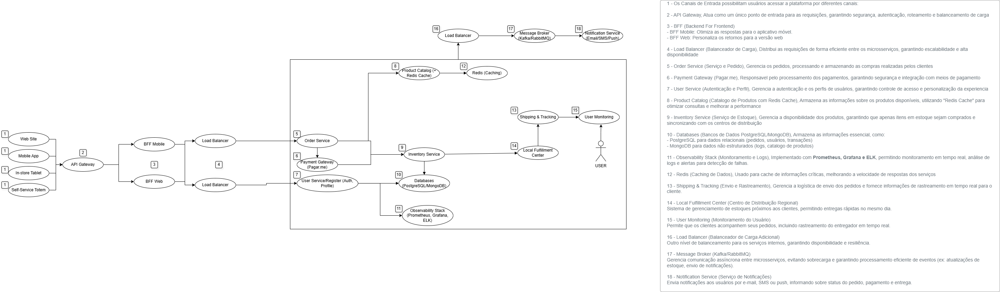

# 🛍️ Plataforma de E-commerce para Startup de Vestuário  

Este repositório contém a arquitetura de microsserviços desenvolvida para uma **plataforma de e-commerce** baseada no conceito de **Guide Shop**. O projeto foi criado como parte de um estudo acadêmico, aplicando boas práticas de arquitetura distribuída e escalável.  

## 📌 Sobre o Projeto  
A proposta é desenvolver uma solução para um **Guide Shop**, onde os clientes podem:  
✔️ **Comprar na loja física** usando um tablet com auxílio de um vendedor ou um totem de autoatendimento.  
✔️ **Receber o pedido no mesmo dia** via centros de distribuição locais.  
✔️ **Acompanhar a entrega em tempo real** pelo aplicativo.  

## 🏗️ Arquitetura  

A solução foi projetada utilizando **microsserviços**, garantindo escalabilidade, resiliência e alta disponibilidade.  

### 🔹 **Diagrama da Arquitetura**  
  

### 📖 **Legenda das Etapas**  

1️⃣ **Canais de Entrada**: Website, App Mobile, Tablets, Totens.  
2️⃣ **API Gateway**: Ponto único de entrada para roteamento e segurança.  
3️⃣ **BFF Mobile/Web**: Backend otimizado para cada plataforma.  
4️⃣ **Load Balancer**: Distribuição de carga entre os microsserviços.  
5️⃣ **Order Service**: Processamento de pedidos.  
6️⃣ **Payment Gateway (Pagar.me)**: Processamento de pagamentos.  
7️⃣ **User Service**: Autenticação e gerenciamento de perfis.  
8️⃣ **Product Catalog (Redis Cache)**: Catálogo de produtos otimizado.  
9️⃣ **Inventory Service**: Controle de estoque.  
🔟 **Databases (PostgreSQL/MongoDB)**: Armazenamento de dados.  
1️⃣1️⃣ **Observability Stack (Prometheus, Grafana, ELK)**: Monitoramento e logs.  
1️⃣2️⃣ **Redis (Caching)**: Cache para alta performance.  
1️⃣3️⃣ **Shipping & Tracking**: Gestão de entregas e rastreamento.  
1️⃣4️⃣ **Local Fulfillment Center**: Centros de distribuição regionais.  
1️⃣5️⃣ **User Monitoring**: Acompanhamento do usuário.  
1️⃣6️⃣ **Load Balancer Adicional**: Balanceamento interno.  
1️⃣7️⃣ **Message Broker (Kafka/RabbitMQ)**: Comunicação assíncrona.  
1️⃣8️⃣ **Notification Service**: Envio de notificações via e-mail, SMS e push.  

---

## 🚀 Tecnologias Utilizadas  

- **API Gateway** 

Escolhemos Python para desenvolver a API Gateway pela sua simplicidade, flexibilidade e forte suporte a integrações. 
- **BFF (Backend for Frontend)** para otimização de comunicação

O BFF irá simplificar a comunicação entre o front-end e os serviços internos, atuando como uma camada intermediária que adapta os dados para cada tipo de cliente (web, mobile, IoT), reduzindo a complexidade e melhorando a performance.

- **Load Balancer** para distribuir requisições

Load Balancer é essencial em uma arquitetura de microsserviços porque melhora a distribuição de tráfego, garantindo alta disponibilidade, escalabilidade e desempenho
- **Redis Cache** para melhorar a performance do catálogo de produtos  

O Redis será essencial para melhorar performance, escalabilidade e resiliência, armazenando dados em memória, permitindo cache eficiente para reduzir a carga em bancos de dados e acelerar respostas.

- **RabbitMQ/Kafka** para comunicação assíncrona entre microsserviços

Optamos pelo RabbitMQ por sua leveza, facilidade de configuração e suporte a filas de mensagens persistentes, sendo ideal para casos que exigem confiabilidade na entrega, como processamento de pedidos e notificações.

Já o Kafka foi escolhido para cenários que exigem streaming de eventos em tempo real, como atualizações de estoque e monitoramento de comportamento do usuário

- **PostgreSQL & MongoDB** para armazenamento de dados

Optamos por escolher PostgreSQL para as operações transacionais pois é um banco de dados relacional e robusto. Possui um SQL fácil e poderoso. O MongoDB foi escolhido pois possui otimo desempenho em lidar com grandes volumes de dados. Será utilizado para os dados semiestruturados, tais como: logs de navegação e carrinho de compras.

- **Prometheus, Grafana, ELK** para observabilidade e logs

Escolhemos o conjunto Prometheus, Grafana e ELK  pois permite analisar logs para identificar erros e padrões, exibição em dashboard da performance da aplicação, alertas sobre desempenho, ajuda a identificar anomalias e funcionam perfeitamente em grandes volumes de logs como um e-commerce.

## 👥 Grupo
### Bruno Elly
### Bruno Lima
### Daniel Lopes
### Gabriel Anchieta

## 📌 Como Utilizar  

1️⃣ Clone este repositório:  
```bash
git clone https://github.com/seu-usuario/seu-repositorio.git
